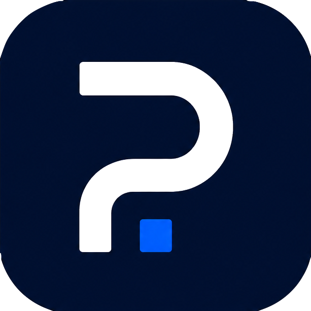

# Partuno

<p align="center">
  
</p>

[](https://github.com/JPMarhefka/partuno/actions/workflows/ci.yml)
[](LICENSE)
[](https://www.python.org/)

## Local-first component intelligence for MCP

Partuno is an open-source Model Context Protocol (MCP) server for electronic
component research, BOM analysis, sourcing comparisons, and carefully bounded
distributor workflows. It connects AI assistants to operator-owned DigiKey and
Mouser credentials while returning evidence, normalized attributes, and
explicit uncertainty.

Partuno was initially developed as a native MCP server. Native MCP is the
recommended connection because it works as an app in ordinary ChatGPT
conversations and exposes richer tool annotations. Existing Custom GPT Action
endpoints remain available for backward compatibility, including
`/action-openapi.json`.

> Partuno does not provide a shared public server or shared distributor
> credentials. The Render configuration is an optional reference deployment
> for an operator's own single-user instance.

## Start here

### Run the local MCP server

The default path is local MCP over stdio. Provider credentials remain in your
environment and the process does not open a public network port.

```bash
git clone https://github.com/JPMarhefka/partuno.git
cd partuno
python3 -m venv .venv
source .venv/bin/activate
python -m pip install -r requirements.txt
cp .env.example .env
python -m partuno
```

Then configure your MCP client to launch `python -m partuno` from the checkout.
See [MCP setup](MCP_SETUP.md) and the [local deployment guide](docs/deployment/local.md).

### Self-host a remote MCP server

If your client requires a reachable HTTPS endpoint, deploy your own instance
with your own provider accounts, OAuth application, signing key, rate limits,
and hosting budget. Start with the [Render reference deployment](docs/deployment/render.md),
or use the [Docker](docs/deployment/docker.md) and [Azure](docs/deployment/azure.md)
guides. There is no shared Partuno endpoint intended for public use.

### Use the existing Action compatibility surface

Custom GPT Actions are retained for existing integrations. The Action/OpenAPI
surface is not the primary architecture; use native MCP for new connections.
The Action setup details are documented in [MCP setup](MCP_SETUP.md).

## What Partuno does

- Searches and inspects electronic components across DigiKey and Mouser.
- Normalizes manufacturer part numbers, units, compliance values, and common
  distributor-specific attribute names.
- Compares exact component offers at a requested quantity, including price
  breaks, minimum order quantities, order multiples, availability, and partial
  provider failures.
- Recommends components against hard requirements while preserving
  `meets`, `does_not_meet`, and `unknown` evidence states.
- Analyzes BOMs for stock, lifecycle, compliance, pricing, tariffs, lead time,
  and substitute candidates.
- Supports bounded account and project workflows such as read-only order
  history, list and quote previews, receiving reconciliation, and carefully
  confirmed mutations where the provider supports them.

See the [capability reference](docs/capabilities.md) for the current scope and
the safety boundary for each workflow.

## What Partuno does not do

- It does not supply DigiKey or Mouser credentials.
- It does not create a shared multi-tenant credential pool.
- It does not silently turn unknown product data into a pass.
- It does not submit distributor orders.
- It does not bypass provider quotas, terms, authentication, or rate limits.

## See it in action

### Featured example: choose a component for a 3.3 V design

Once Partuno is connected, a user can simply ask:

```text
I’m choosing a dual op amp for a 3.3 V circuit. Find a few LM358-family
options that can operate at 3.3 V, are RoHS compliant, normally stocked, and
available in a quantity of 10. Show the evidence behind each recommendation
and keep uncertain data clearly marked.
```

Partuno turns that plain-language request into a provider-aware result with
qualified, unverified, and rejected candidates; normalized voltage and
compliance evidence; cross-distributor availability; quantity pricing; and a
Pareto shortlist. It does not silently treat missing specifications as a
pass.

See [more natural-language examples](docs/examples/README.md) for comparison,
product research, BOM review, and safe account-preview workflows.

## Documentation

| Topic | Guide |
| --- | --- |
| Capabilities and safety boundaries | [Capability reference](docs/capabilities.md) |
| Native MCP connection | [MCP setup](MCP_SETUP.md) |
| Local stdio or loopback HTTP | [Local deployment](docs/deployment/local.md) |
| Docker deployment | [Docker deployment](docs/deployment/docker.md) |
| Operator-owned Render deployment | [Render reference](docs/deployment/render.md) |
| Azure deployment | [Azure deployment](docs/deployment/azure.md) |
| Security and credential handling | [Security guide](docs/security.md) |
| Offline and live validation | [Testing guide](docs/testing.md) and [validation notes](VALIDATION.md) |
| Natural-language usage examples | [Examples](docs/examples/README.md) |
| Contributing | [CONTRIBUTING.md](CONTRIBUTING.md) |
| Security reports | [SECURITY.md](SECURITY.md) |
| Release history | [CHANGELOG.md](CHANGELOG.md) |

## Logo assets

The [full-resolution Partuno logo](docs/assets/partuno-logo.png) is available
for project pages, client listings, and integration documentation. A
[compact plugin icon](docs/assets/partuno-plugin-icon.png) is also included for
client or plugin upload fields with strict PNG size limits.

The compact icon is intentionally optimized for small upload limits. If a host
accepts larger assets, use the full-resolution logo instead. The compact icon
can also be downloaded directly from the repository's
[raw asset URL](https://raw.githubusercontent.com/JPMarhefka/partuno/main/docs/assets/partuno-plugin-icon.png).

When using the logo in a ChatGPT app, MCP client, or other plugin integration,
identify the integration as Partuno and do not imply endorsement by DigiKey,
Mouser, or another provider. Check the host platform's current dimensions,
format, and file-size requirements before uploading.

## Deployment and credential model

| Mode | Best for | Credential ownership |
| --- | --- | --- |
| Local stdio | Desktop MCP clients and personal development | Operator's local environment |
| Loopback HTTP | Clients that cannot launch stdio | Operator's local environment |
| Remote HTTPS | A self-hosted ChatGPT/Codex connection | Operator's own deployment and accounts |

Remote mode adds OAuth and HTTPS because a hosted MCP endpoint must authenticate
the client and protect upstream access. It is optional; local mode remains the
default and does not require Partuno OAuth.

## Project status

Partuno 4.0.0 is an active open-source release. The test suite covers offline
provider contracts, MCP tool behavior, REST compatibility, credential safety,
normalization, and the multi-distributor workflows. Live provider calls are
opt-in because they require operator credentials and are subject to provider
quotas.

See [testing](docs/testing.md) before running live smoke tests.

## License and independence

Partuno is released under the [Apache License 2.0](LICENSE). See [NOTICE](NOTICE)
for project attribution and independence statements. Partuno is not affiliated
with, endorsed by, or sponsored by DigiKey, Mouser, or any manufacturer or
distributor named in the project. Their names and marks identify integrations
only.
