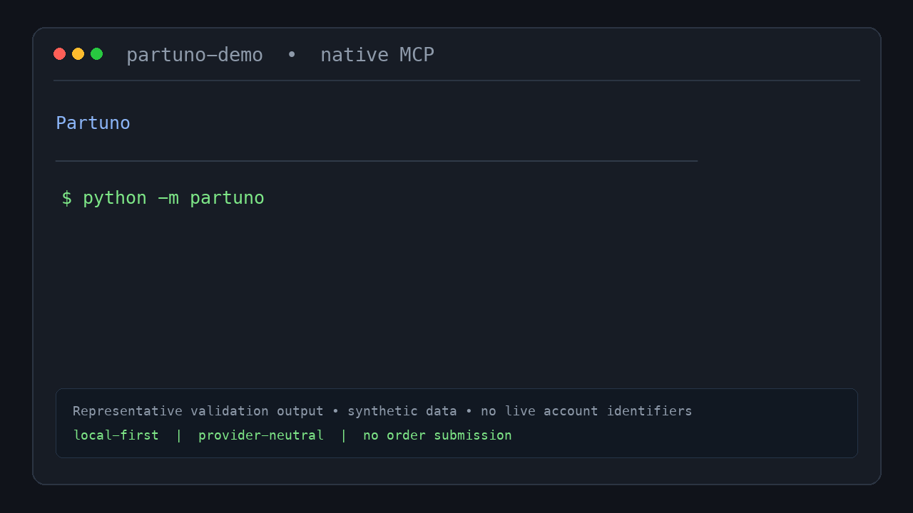

# Partuno

[](https://github.com/JPMarhefka/partuno/actions/workflows/ci.yml)
[](LICENSE)
[](MCP_SETUP.md)

## Local-first component intelligence for MCP

Open-source MCP server for electronic component research, BOM analysis,
sourcing optimization, and safe distributor workflows.



Partuno helps an AI client find, compare, qualify, and plan electronic
components across distributor catalogs without turning a chat into an
uncontrolled purchasing system. It is designed to run on the operator's
machine with operator-owned credentials, and can optionally be hosted as a
single-user remote MCP server.

### Start here

```bash
git clone https://github.com/JPMarhefka/partuno.git
cd partuno
python3 -m venv .venv
source .venv/bin/activate
python -m pip install -r requirements.txt
cp .env.example .env
set -a
source .env
set +a
python -m partuno
```

The default transport is MCP stdio, so no local network port is opened. Add
your own provider credentials to `.env`, then configure your MCP client to
launch `python -m partuno` from this directory. See the [local deployment
guide](docs/deployment/local.md) for client-specific setup and the
[MCP setup guide](MCP_SETUP.md) for optional remote HTTP deployments.

### What Partuno does

- Searches DigiKey and Mouser catalog data through one native MCP server.
- Compares exact manufacturer/MPN identities and requested-quantity offers.
- Recommends parts using explicit engineering evidence and preserves unknowns.
- Analyzes BOM stock, lifecycle, compliance, pricing, tariffs, and lead time.
- Provides guarded MyList, quote, receiving, and Mouser Cart workflows.
- Keeps consequential mutations behind explicit confirmation and never submits
  a purchase order.

### What Partuno does not do

- It does not provide shared distributor credentials.
- It does not operate as a multi-tenant credential vault.
- It does not estimate shipping, tax, or delivery when the provider does not
  supply those values.
- It does not submit orders or silently retry account-changing operations.

### Connection choices

Partuno was initially developed as a native MCP server. Native MCP is the
recommended connection because it works as an app in normal ChatGPT
conversations and exposes richer tool annotations. The existing REST/OpenAPI
Custom GPT Action endpoints remain available for backward compatibility,
including `/action-openapi.json`; see the [Action compatibility
section](#optional-backward-compatible-custom-gpt-action-setup) if you need
that older integration.

### Project status

The `4.0.0` codebase has a passing offline regression suite and validated
read-only DigiKey/Mouser comparison and recommendation workflows. Hosted OAuth
is an optional reference deployment; local self-hosting is the primary public
distribution path.

### License and independence

Partuno is released under the [Apache License 2.0](LICENSE). It is an
independent project and is not affiliated with, endorsed by, or sponsored by
DigiKey, Mouser, or any other provider named in the documentation. See
[`NOTICE`](NOTICE) for the complete independence and credential-responsibility
notice.

Partuno is provider-neutral, local-first, and self-hostable. It connects to
DigiKey and Mouser through credentials supplied by the operator or through a
user-authorized DigiKey OAuth session. Partuno does not provide shared
distributor credentials or require a Partuno account.

Partuno is not affiliated with, endorsed by, or sponsored by DigiKey, Mouser,
or any other listed distributor. Provider names identify integrations only; see
[`NOTICE`](NOTICE) for the full independence notice.

Maintainer: JP Marhefka.

The distributor-neutral layer provides strict offer comparison, requested-
quantity price normalization, and evidence-based project recommendations.
Mouser adds catalog search, read-only Order History, and preview-confirmed Cart
workflows. The existing DigiKey integration continues to provide:

- Product Information V4
- Product Change Notifications
- MyLists
- Order Status
- Quote
- Barcode and Packing List
- Reference APIs

The server includes both direct DigiKey endpoint wrappers and higher-level
workflows that reduce the number of calls ChatGPT must coordinate.

## Implemented features

### Multi-distributor comparison and recommendations

- DigiKey and Mouser catalog calls run concurrently behind one MCP server
- Exact comparisons accept up to 10 manufacturer/MPN/quantity rows per request
- Products merge only when manufacturer identity and exact MPN agree
- MPN punctuation and suffixes are preserved during identity matching
- MOQ, order multiple, applicable price break, purchasable quantity, stock,
  lifecycle, compliance, and manufacturer lead time are normalized
- USD merchandise totals exclude shipping and tax and retain duty/tariff assumptions
- Failed or rate-limited sources produce `partial` without a declared winner
- Project searches return `meets`, `does_not_meet`, or `unknown` evidence
- Compatible SI units are converted; ambiguous and missing attributes stay unknown
- Up to five qualified, non-dominated candidates form the Pareto shortlist
- Shipping cost and delivery ETA are explicitly unavailable

### Mouser account workflows

- Search by keyword, exact part number, and manufacturer
- Read Order History by filter, date range, sales order, or web order
- Read, create, add, update, remove, or fully replace Cart contents
- Create a Cart from an order and manage scheduled releases
- Preview every Cart mutation before execution with an expiring one-time token
- Show all removals before whole-Cart replacement
- Never retry Cart mutations automatically
- Track Search and Account API-key minute/day budgets separately in process
- Never expose Mouser order submission

### Product research

- Keyword, manufacturer-part-number, and DigiKey-part-number search
- Pagination with `limit` and `offset`; local conformance fallback scans are
  bounded by `SEARCH_FALLBACK_MAX_PAGES`
- Manufacturer, category, status, packaging, and series filters
- Marketplace and tariff filtering through DigiKey KeywordSearch native filters, with a marked local conformance fallback only when a response contains explicitly non-matching variations
- Minimum available quantity
- Parametric filters using IDs returned by an earlier broad search
- Search field selection with DigiKey `includes`
- Product details, current stock, lifecycle, lead time, classifications, and pricing
- Current product pricing with pagination
- Pricing options by requested quantity
- DigiReel pricing
- Datasheets, images, documents, and video media
- Substitutions (the requested limit is sent upstream and enforced locally)
- Recommended products (filters are optional; a DigiKey 404/500 caused by
  explicit filters is retried once without those filters and marked with a warning;
  DigiKey's upstream recommendation-record limit is passed through, while nested
  `RecommendedProducts` remain untruncated and are identified in `_meta`)
- Associated products and accessories
- Alternate packaging
- Product-change notifications with raw API dates plus parsed description-date
  mismatch diagnostics
- Manufacturer directory with local `limit`/`offset` pagination (default 100 records)
- Category tree and category lookup
- Associated account lookup

### BOM workflows

- Consolidate duplicate BOM rows
- Analyze multiple products concurrently
- Resolve exact product details for every item
- Calculate current estimated cost
- Flag insufficient stock
- Flag discontinued and end-of-life products
- Flag last-buy dates
- Flag long manufacturer lead times
- Include RoHS, REACH, MSL, ECCN, and HTS classification data
- Retrieve PCNs
- Retrieve substitutes for risky parts
- Retrieve alternate packaging
- Optimize exact, MOQ, BetterValue, and maximum-order pricing options
- Allow or reject increased purchase quantities
- Allow or reject Marketplace products
- Allow or reject tariff-bearing options
- Compare DigiReel options
- Report raw MOQ separately from an effective MOQ derived from the first usable
  price break or package evidence

### MyLists

- List and inspect MyLists
- Retrieve every list part across pagination
- Use a compact MCP parts view by default, with `response_detail=full` available
  for the unmodified DigiKey part records
- Preserve raw visibility fields while reporting normalized effective access
  and contradictory-access warnings
- Create, rename, and delete lists
- Add parts
- Update part number, quantity, package, target price, notes, references, and attrition
- Remove parts
- Read before update so unspecified fields are preserved
- Dry-run a proposed BOM against an existing MyList
- Show exact additions, updates, removals, and unchanged rows
- Detect and consolidate duplicates
- Optionally remove products absent from the proposed BOM
- Apply an explicitly approved list sync; ambiguous product aliases abort before any write
- Return partial progress if a multi-step synchronization fails

### Lifecycle audit

- Audit either a supplied BOM or an existing MyList
- Return only meaningful lifecycle, availability, lead-time, and PCN alerts
- Include substitutes for risky products

### Quotes

- List quotes
- Retrieve quote metadata
- Retrieve quote products and locked prices
- Create an empty quote
- Add up to 300 product rows per DigiKey request
- Create and populate a quote directly from a BOM or MyList

### Barcodes and receiving

- Decode product-bag 1D barcodes
- Decode product-bag 2D barcodes
- Decode packing-list 1D barcodes
- Decode packing-list 2D barcodes
- Decode a batch and total received quantities by part number
- Compare received quantities against a MyList
- Retrieve packing lists by invoice number
- Retrieve packing lists by sales-order number
- Retrieve packing lists by purchase-order number
- Optionally include the packing-list PDF

### Reliability and safety

- Retries read-only operations after transient HTTP 429 and 502–504 responses;
  a detected DigiKey daily-limit 429 stops after its first attempt
- Respects DigiKey's `Retry-After` header within a configured maximum wait
- Returns DigiKey rate-limit and correlation/request IDs in `_meta`, including
  sanitized attempt history when a retry occurs
- Preserves failed calls as structured REST and MCP error envelopes, including status, retryability, correlation IDs, and rate-limit diagnostics
- Does not automatically retry writes
- Retries only the documented recommendation compatibility case once; research
  bundles retain successful enrichments, report section errors, and expose an
  aggregate `success`, `partial`, or `failed` status
- Uses parent PricingOptionsByQuantity availability and keeps ProductDetails package availability separate for BOM decisions
- Caches successful PCN reads briefly in-process to reduce pressure on DigiKey's
  daily PCN budget; cached entries remain scoped to a hashed OAuth principal
- Skips unpriceable alternate-packaging candidates without discarding the original BOM pricing result
- Caps workflow concurrency and unique BOM size
- Marks account-changing GPT actions as consequential
- Does not include Ordering and cannot submit a real purchase
- REST/OpenAPI mode never receives the DigiKey client secret
- Native MCP mode stores the DigiKey client secret only as a protected Render secret
- Never logs OAuth bearer tokens

### Normalized reliability fields

Successful DigiKey response fields remain compatible. Reliability corrections
are additive:

- Search responses report `_meta.filter_enforcement` as `native` when DigiKey's
  variations conform. A bounded `local_fallback` removes only explicitly
  non-matching tariff or Marketplace variations and reports whether the
  requested result window is complete.
- Pricing variations retain `MinimumOrderQuantity` and add
  `raw_minimum_order_quantity`, `effective_minimum_order_quantity`, and
  `effective_moq_source`. Pricing-by-quantity availability comes from the parent
  option; ProductDetails package stock remains a separate
  `variation_quantity_available` value in BOM results.
- Compact MyList parts include selected package identity, effective MOQ, and
  substitution counts. Large substitutions, environmental documents, images,
  and empty fields are opt-in. Full mode preserves the raw part shape.
- MyList reads retain DigiKey's raw visibility values and add
  `effective_access` plus warnings. A list-specific HTTP 403 is reported as
  `deleted_or_inaccessible` while preserving the upstream 403.
- PCNs retain `PcnChangeDate` and add `api_change_date`, `description_date`,
  `date_mismatch_days`, and `date_warning`. Successful reads use the bounded
  `PCN_CACHE_SECONDS` cache; daily-limit failures remain structured,
  non-retryable errors.
- Combined offers expose `pricing_quantity_available` independently from
  `variation_quantity_available`; the compatibility `quantity_available` field
  continues to reflect variation/package stock.
- Mouser correlation metadata prefers `X-Correlation-Id` or `X-Request-Id`,
  then common response-body request ID fields, and remains null when Mouser
  supplies no identifier. Region-restricted records remain visible with null
  commercial fields and `availability_status=regional_unavailable`.

## Files

```text
main.py                 FastAPI routes and OpenAPI schemas
services.py             DigiKey wrappers and high-level workflows
client.py               OAuth forwarding, retries, rate-limit metadata
models.py               Validated request models
config.py               Environment configuration
distributor_models.py   Provider-neutral and Mouser request contracts
distributors.py         Adapter and credential-provider interfaces
credentials.py          Provider-specific BYOK credential store and contracts
identity.py             Stable opaque principal derivation from verified accounts
mouser_client.py        API-key transport, redaction, retries, rate budgets
mouser_services.py      Search, history, Cart, and confirmation-token workflows
multi_distributor.py    DigiKey adapter, comparison, and recommendations
MCP_STRESS_TEST_MANIFEST.json
                        Repeatable schema-valid live stress-test calls
normalization.py        Strict identity, decimal pricing, units, and evidence
requirements.txt        Production dependencies
requirements-dev.txt    Test dependencies
render.yaml              Render deployment blueprint
Dockerfile               Container deployment
Procfile                 Generic Python-host start command
.env.example             Safe environment template
NOTICE                   Distributor independence and credential responsibility notice
tests/                   Offline unit and schema tests
```

## Deployment modes

`PARTUNO_MODE=local` is the default for self-hosted use. Provider credentials
remain in the operator's environment, and the local deployment does not require
Render, a database, or a Partuno service account.

The local MCP launcher uses stdio by default:

```bash
python3 -m venv .venv
source .venv/bin/activate
python -m pip install -r requirements.txt
cp .env.example .env
set -a && source .env && set +a
python -m partuno
```

Configure a desktop MCP client to launch that command from the repository
directory. For clients that require HTTP, use
`python -m partuno --transport streamable-http`; it binds to `127.0.0.1:8000`
by default. See [`docs/deployment/local.md`](docs/deployment/local.md).

`PARTUNO_MODE=remote_single_user` enables the optional hosted-style OAuth proxy
for one operator's deployment. It is intended for a personal or reference
instance, not as a shared multi-tenant credential service. Each operator is
responsible for obtaining provider credentials and following provider terms.

## Architecture

```text
Local MCP client or remote single-user client
        |
        | operator-owned credentials / OAuth session
        v
Partuno
        |                              |
        | DigiKey bearer               | protected Mouser API keys
        v                              v
DigiKey production APIs          Mouser Search/Cart/History APIs
```

In local mode, provider credentials stay in the operator's environment and
DigiKey access and refresh tokens remain scoped to the user's authorization
session. The optional `remote_single_user` mode requires the DigiKey client
secret and a stable MCP signing key as protected deployment secrets because
FastMCP performs the authorization-code exchange. Mouser Search and Account
keys remain separate provider credentials in both modes.

## Native MCP for ChatGPT and Codex

Partuno was initially developed as a native MCP server. The same deployment
exposes a Streamable HTTP MCP endpoint at `/mcp` while preserving the REST and
OpenAPI endpoints for backward compatibility. Native MCP is the recommended
connection because it works as an app in normal ChatGPT conversations and
exposes richer MCP tool annotations. Configure the remote plugin using:

```text
Name: Partuno
Description: Open-source MCP server for electronic component research, BOM analysis, sourcing optimization, and safe distributor workflows.
Server URL: https://YOUR-SERVICE.onrender.com/mcp
Authentication: OAuth
```

See [MCP_SETUP.md](MCP_SETUP.md) for Render secrets, DigiKey callback setup,
ChatGPT tool scanning, Codex connection, and Free-tier reconnection behavior.

## Deploy on Render

### 1. Put the files in GitHub

Create or use a repository for this project and upload the contents of this
folder. Do not upload a `.env` file or any provider credential.

### 2. Create the Render service

1. Select **New > Web Service**.
2. Select the repository.
3. Use the repository's `render.yaml`, or configure it manually.
4. For the optional remote single-user deployment, add:

```text
PARTUNO_MODE=remote_single_user
DIGIKEY_CLIENT_ID=your_production_client_id
```

5. For native MCP, also add protected Render secrets:

```text
DIGIKEY_CLIENT_SECRET=your_production_client_secret
MOUSER_SEARCH_API_KEY=your_search_api_key
MOUSER_ACCOUNT_API_KEY=your_cart_and_history_api_key
MCP_BASE_URL=https://YOUR-SERVICE.onrender.com
MCP_JWT_SIGNING_KEY=<openssl rand -base64 48 output>
```

The DigiKey client secret is only needed for native MCP OAuth. Mouser keys stay
on the server and are never accepted as MCP or REST tool inputs. Do not commit
any of these values to GitHub.

The included Dockerfile starts `uvicorn app:app --host 0.0.0.0 --port $PORT`.
Render is an optional reference deployment for `remote_single_user` mode. It
sleeps after 15 minutes idle on the Free instance and may take about a minute
to wake; reconnect OAuth after a spin-down, restart, or deploy.

### 3. Verify deployment

Open:

```text
https://YOUR-RENDER-DOMAIN/health
```

Expected result:

```json
{
  "status": "ok",
  "version": "4.0.0"
}
```

Then open:

```text
https://YOUR-RENDER-DOMAIN/action-openapi.json
```

This is the compact REST/OpenAPI schema for the retained Custom GPT Action
compatibility path. It includes DigiKey, Mouser, comparison, recommendation,
Order History, and preview-confirmed Cart operations.

The complete debugging schema is available at:

```text
https://YOUR-RENDER-DOMAIN/full-openapi.json
```

Import `action-openapi.json` into ChatGPT only when you are using the retained
Custom GPT Action compatibility path. Native MCP users should connect to
`/mcp` as described in [MCP_SETUP.md](MCP_SETUP.md).

## Optional backward-compatible Custom GPT Action setup

The following instructions configure the older REST/OpenAPI integration as a
GPT Action. They remain available for existing users, but are not the primary
Partuno connection. For the native MCP plugin shown in ChatGPT's **New Plugin**
dialog, use [MCP_SETUP.md](MCP_SETUP.md) and the `/mcp` Server URL instead.

1. Open the GPT editor.
2. Create or edit `Partuno Assistant`.
3. Open **Configure > Actions > Create new action**.
4. Choose **OAuth**.
5. Enter the DigiKey production Client ID and Client Secret.
6. Use these URLs:

```text
Authorization URL:
https://api.digikey.com/v1/oauth2/authorize

Token URL:
https://api.digikey.com/v1/oauth2/token
```

7. Leave scope blank.
8. Use the normal authorization-code token exchange. DigiKey expects the
   client ID and client secret as form fields in the token request.
9. Copy the callback URL displayed by the GPT editor.
10. Edit the DigiKey production application.
11. Replace `https://localhost` with the exact ChatGPT callback URL.
12. Preserve the exact scheme, path, and trailing slash.
13. Save the DigiKey application.
14. Import this schema URL in the GPT Action editor:

```text
https://YOUR-RENDER-DOMAIN/action-openapi.json
```

15. Save the action and select **Sign in** in GPT Preview.

## Recommended GPT instructions

Paste this into the GPT's Instructions field:

```text
You are Partuno, a DigiKey and Mouser component research, comparison,
recommendation, BOM, receiving, cart, quote, MyLists, and order-status assistant.

Before recommending a component, collect every critical engineering constraint.
Return requirement evidence as meets, does not meet, or unknown. Never infer a
missing critical value or turn manufacturer lead time into a shipping estimate.

Use strict manufacturer plus MPN comparisons. Compare the purchasable quantity
and USD merchandise total. If either distributor fails, show partial data but
do not name a winner. Shipping cost, delivery ETA, and tax are unavailable.

Before changing a Mouser Cart, preview the exact diff and show it to the user.
Execute only the approved one-time preview token. Never submit an order.

Use DigiKey actions for factual product specifications, stock, pricing,
manufacturer, category, lifecycle, PCN, quote, barcode, list, packing-list, and
order information. Prefer exact DigiKey product numbers for product details,
pricing, MyList changes, quotes, and PCNs.

For current stock and account pricing, use product details, pricing, or pricing
by quantity rather than relying only on KeywordSearch. KeywordSearch is best for
finding candidates and parametric filter IDs.

For parametric search, first run a broad search, inspect the returned filter and
parameter IDs, then run a narrower search using those exact IDs. Do not invent
DigiKey parameter IDs or value IDs.

For BOM research, consolidate duplicate part numbers, analyze every requested
quantity, show estimated extended cost, and flag lifecycle, stock, lead-time,
compliance, tariff, Marketplace, and PCN risks. Distinguish substitutions from
alternate packaging and from associated accessories.

For pricing optimization, compare exact quantity, MOQ, BetterValue, package,
and DigiReel choices. Clearly state when buying more units lowers total cost.
Never change the requested quantity without explaining the recommended purchase
quantity.

Before creating or renaming a list, adding or updating parts, removing a part,
deleting a list, syncing a list, creating a quote, or adding quote products,
summarize the exact action and obtain explicit approval. Never infer approval
from an unrelated earlier message.

Always run the MyList diff action before a large synchronization. Show
additions, updates, removals, and duplicate consolidation before asking for
approval. Set confirm=true only after the user approves that exact diff.

Before deleting anything, retrieve and identify the exact list or list part.

When creating a quote from a BOM or MyList, show the quote name, account ID,
product count, quantities, and source before requesting approval. Quotes lock
pricing but do not place an order.

When decoding barcodes, total duplicate received product quantities. When asked
to check a delivery, compare scanned quantities to the intended MyList and show
short, complete, and extra items.

When checking an order, distinguish the DigiKey order number from each Sales
Order ID. Include shipment status, quantities shipped and backordered, tracking
number, and expected delivery date when returned.

Never place an order. This integration has no Ordering permission.
```

## Suggested tests in GPT Preview

### Cross-distributor recommendation

```text
I need a dual op-amp for a 5 V battery-powered sensor with at least 1 MHz
gain-bandwidth and low quiescent current. Ask me for any missing critical
constraints, then compare qualified DigiKey and Mouser candidates.
```

### Exact offer comparison

```text
Compare 25 units of Texas Instruments LM358DR across DigiKey and Mouser. Show
MOQ, purchasable quantity, merchandise total, stock, and manufacturer lead time.
Do not estimate shipping.
```

### Mouser Cart safety

```text
Preview adding 10 units of the selected Mouser SKU to a new Cart. Show the
exact diff and wait for approval before using the execution token.
```

### Account selection

```text
Show the DigiKey account IDs associated with my login and explain which account
I should use for personal purchases.
```

### Parametric search

```text
Search broadly for I2C CO2 sensors, show the returned parametric filters, then
narrow the search to in-stock, normally stocked, RoHS-compliant parts with at
least 25 available. Exclude Marketplace products.
```

### BOM analysis

```text
Analyze this prototype BOM for current price, stock, lifecycle, lead time,
compliance, product-change notifications, and substitutes:
5 x ESP32-S3-WROOM-1-N8R8
5 x SCD40-D-R2
20 x RC0603FR-0710KL
```

### Pricing optimization

```text
For 80 units of this DigiKey part, determine whether an MOQ or BetterValue
quantity has a lower total cost. Compare Cut Tape, reel, and DigiReel where
available.
```

### MyList synchronization

```text
Compare this BOM against my Pulse Prototype V1 list. Show a dry-run with every
addition, update, duplicate, and removal. Do not apply changes yet.
```

### Quote

```text
After I approve, create a quote named Pulse Rev A Prototype from my Pulse
Prototype V1 MyList.
```

### Receiving

```text
Decode these product-bag QR codes, total the quantities, and compare what arrived
against my Pulse Prototype V1 list.
```

### Lifecycle audit

```text
Audit every part in Pulse Prototype V1. Only show products with lifecycle,
last-buy, PCN, stock, or lead-time risks, and include in-stock substitutes.
```

## Local validation

Install test dependencies:

```bash
python -m venv .venv
source .venv/bin/activate
pip install -r requirements-dev.txt
```

Run tests without real DigiKey credentials:

```bash
DIGIKEY_CLIENT_ID=test-client-id pytest -q
```

Current offline validation covers:

- Complete parametric search payload generation
- BetterValue quantity selection
- Preventing unwanted quantity increases
- MyList additions, updates, removals, and duplicate consolidation
- Barcode result normalization
- Unique OpenAPI operation IDs
- No user-visible Authorization-header parameters
- Exactly 30 operations in the compact action schema
- Consequential markings for destructive or account-changing actions
- Partuno public metadata and provider user-agent branding

## Important testing note

The package is syntax-checked and tested with mocked response shapes. It has not
been exercised against your live DigiKey production credentials. DigiKey can
return account-specific variations, so begin with read-only calls in GPT Preview
before testing list changes or quote creation.
