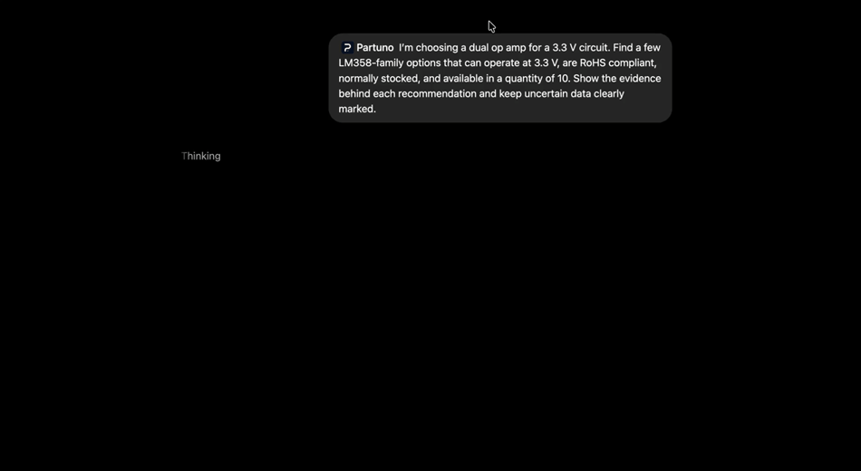
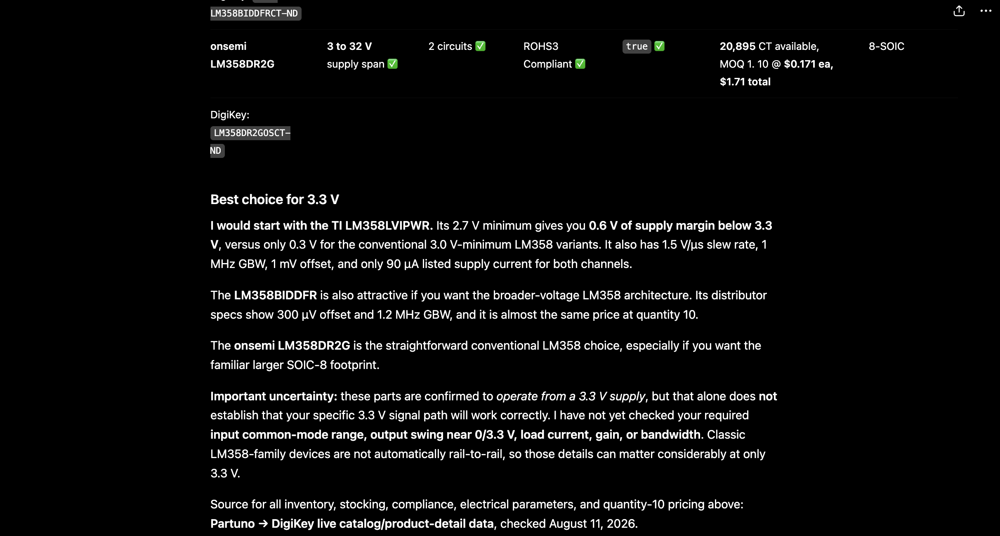
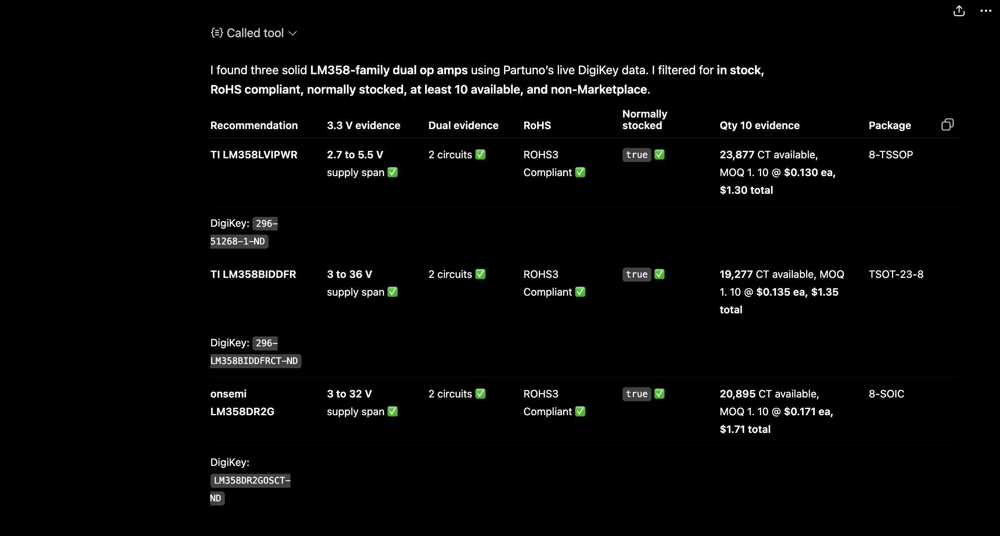
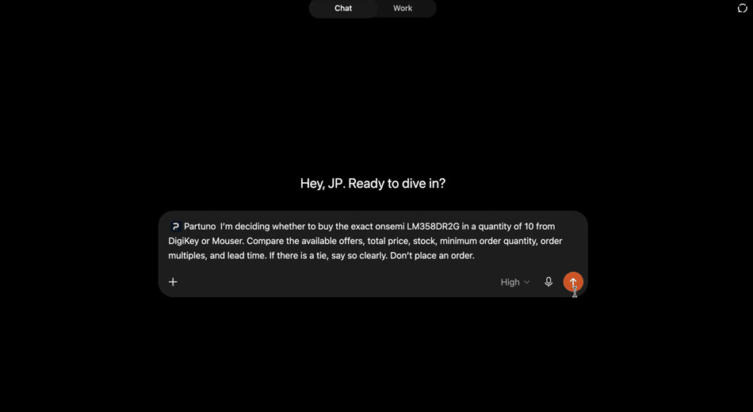
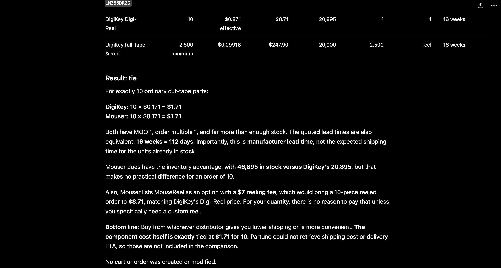
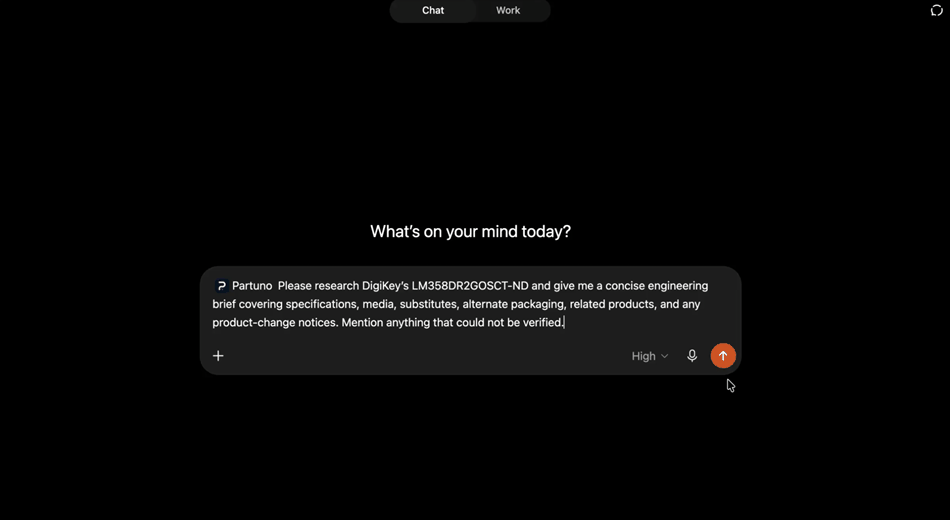
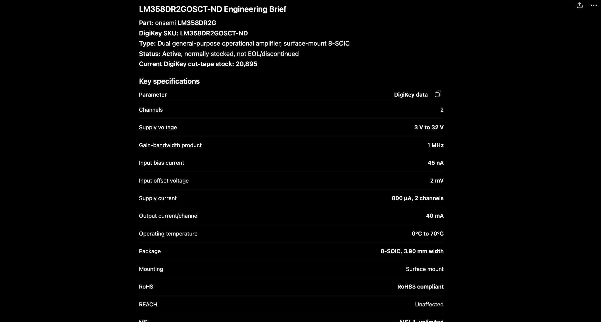
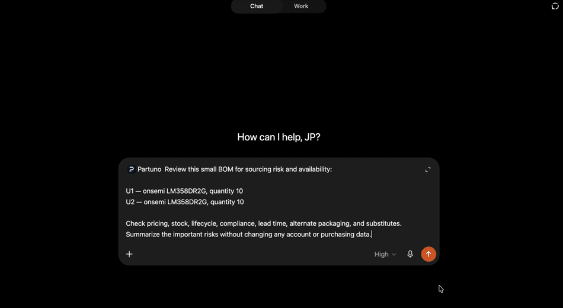
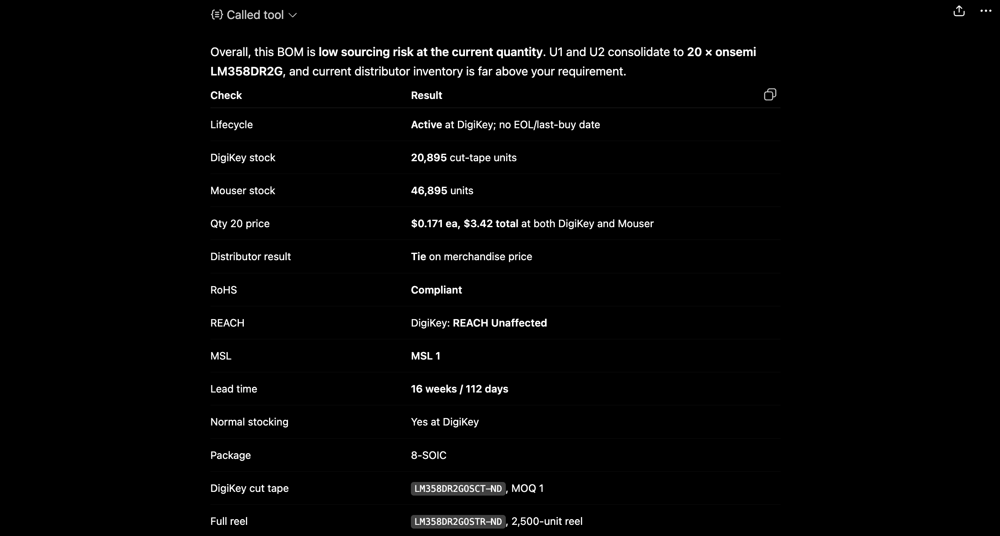
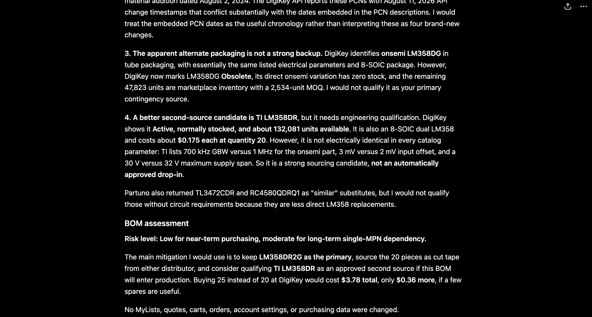

# Natural-language examples

These examples are written for a user chatting with ChatGPT, Codex, or another
MCP client connected to Partuno. They intentionally describe the engineering
goal in ordinary language rather than naming tools or supplying JSON payloads.

Run one example at a time for a clean screen recording and to keep provider
quotas predictable. Keep the final response focused on evidence and outcomes.

## 1. Choose a component for a 3.3 V design

```text
I’m choosing a dual op amp for a 3.3 V circuit. Find a few LM358-family
options that can operate at 3.3 V, are RoHS compliant, normally stocked, and
available in a quantity of 10. Show the evidence behind each recommendation
and keep uncertain data clearly marked.
```

This is the recommended featured example. It demonstrates cross-provider
search, attribute normalization, hard-requirement evaluation, explicit
uncertainty, quantity-aware offers, and the Pareto shortlist.



<details>
<summary>View response screenshots</summary>





</details>

## 2. Compare exact offers across distributors

```text
I’m deciding whether to buy the exact onsemi LM358DR2G in a quantity of 10
from DigiKey or Mouser. Compare the available offers, total price, stock,
minimum order quantity, order multiples, and lead time. If there is a tie, say
so clearly. Don’t place an order.
```

This demonstrates strict manufacturer-and-MPN identity, purchasable quantity,
price-break handling, partial provider status, and the difference between a
tie and a false winner.



<details>
<summary>View response screenshot</summary>



</details>

## 3. Research one component deeply

```text
Please research DigiKey’s LM358DR2GOSCT-ND and give me a concise engineering
brief covering specifications, media, substitutes, alternate packaging,
related products, and any product-change notices. Mention anything that could
not be verified.
```

This shows the lean product-research path plus opt-in enrichment while keeping
partial enrichment failures visible.



<details>
<summary>View response screenshot</summary>



</details>

## 4. Review a small BOM for sourcing risk

```text
Review this small BOM for sourcing risk and availability:

U1 — onsemi LM358DR2G, quantity 10
U2 — onsemi LM358DR2G, quantity 10

Check pricing, stock, lifecycle, compliance, lead time, alternate packaging,
and substitutes. Summarize the important risks without changing any account
or purchasing data.
```

This demonstrates BOM-level stock, lifecycle, compliance, pricing, lead-time,
substitute, and packaging analysis.



<details>
<summary>View response screenshots</summary>





</details>

## 5. Preview an account change without applying it

```text
Show me what would change if I added 10 LM358DR2GOSCT-ND parts to my DigiKey
list. Give me a dry-run preview only. Do not apply the change, rename the list,
delete anything, or modify my account.
```

This demonstrates the safety boundary: read-only inspection and a proposed
diff can be shown without executing a mutation. Redact list IDs, account IDs,
customer references, and private project names before publishing a recording.

## Catalog search and technical validation

The Catalog search capture is intentionally kept out of the main public
showcase for now. Its current prompt explicitly names tool calls and JSON-style
filters, so it demonstrates protocol-level testing more than the ordinary
plain-English user experience. The local capture remains useful for technical
smoke testing.

If it is published later, record the same workflow from a natural-language
request such as: “Find three in-stock, RoHS-compliant LM358-family options for
a 3.3 V design, show the key evidence and quantity-10 availability, and do not
place an order.”
Keep original MP4 or MOV files outside the repository unless they are also
sanitized and intentionally published. Never include credentials, OAuth
codes, bearer tokens, private URLs, customer data, or reusable mutation
tokens.
